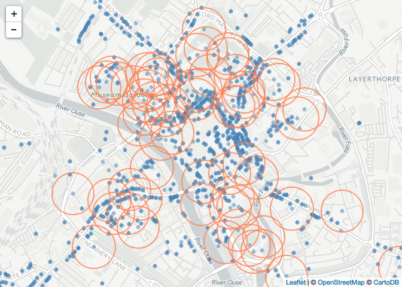
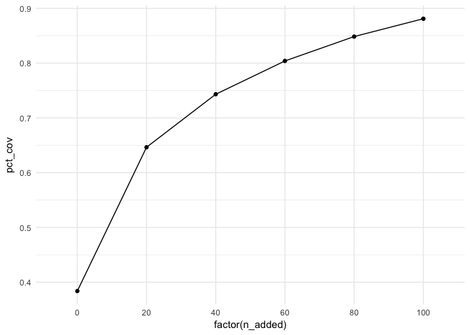

<!-- README.md is generated from README.Rmd. Please edit that file -->
maxcovr
=======

[](https://ci.appveyor.com/project/njtierney/maxcovr)[](https://travis-ci.org/njtierney/maxcovr)[](https://codecov.io/github/njtierney/maxcovr?branch=master)

maxcovr was created to make it easy for a non expert to correctly solve the maximum covering location problem described by [Church](http://www.geog.ucsb.edu/~forest/G294download/MAX_COVER_RLC_CSR.pdf). Implementations of this problem (such as [optimimum AED placement](http://circ.ahajournals.org/content/127/17/1801.short)) may use commercial software such as AMPL, Gurobi, or CPLEX, which require an expensive license. This builds a substantial barrier to implement and reproduce these analyses.

maxcovr was created to make results easy to implement, reproduce, and extend by using:

-   R, a free and open source language
-   An open source solver, lpSolve, that can be used on Linux, Windows, and OSX.
-   Real-world, open source example data.
-   Tidyverse principles to make it easy to use and reason with.

How to Install
==============

*warning: maxcovr is still undergoing development and testing*

``` r

# install.packages("devtools")
devtools::install_github("njtierney/maxcovr")
```

Using maxcovr
=============

Disclaimer: The following is a fictitious example using real world data.

Consider the toy example where we are playing a tower defense game and we need to place crime surveillance towers to detect crime.

We have two datasets, `york`, and `york_crime`:

-   `york` contains listed building GPS locations in the city of York, provided by the city of york
-   `york_crime` contains a set of crime data from the [`ukpolice` package](https://www.github.com/njtierney/ukpolice), containing crime data from September 2016.

In this game we already have a few towers built, which are placed on top of the listed buildings with a grade of I. We will call this dataset `york_selected`, and the remaining building locations `york_unselected`

``` r

library(maxcovr)
library(tidyverse)
#> Loading tidyverse: ggplot2
#> Loading tidyverse: tibble
#> Loading tidyverse: tidyr
#> Loading tidyverse: readr
#> Loading tidyverse: purrr
#> Loading tidyverse: dplyr
#> Conflicts with tidy packages ----------------------------------------------
#> filter(): dplyr, stats
#> lag():    dplyr, stats

# subset to be the places with towers built on them.
york_selected <- york %>% filter(grade == "I")

york_unselected <- york %>% filter(grade != "I")
```

The purpose of the game is to build towers in places so that they are within 100m of crime. We are going to use the crime data that we have to help us choose ideal locations to place towers.

This can be illustrated with the following graphic, where the red circles indicate the current coverage of the building locations, so those blue crimes within the circles are within the coverage.

    #> Assuming 'long' and 'lat' are longitude and latitude, respectively
    #> Assuming 'long' and 'lat' are longitude and latitude, respectively



Currently the coverage looks alright, but let's verify the coverage using the `nearest` function. `nearest` takes two dataframes and returns the nearest lat/long coords from the first dataframe to the second dataframe, along with the distances between them and the appropriate columns from the building dataframe.

``` r

dat_dist <- york_selected %>% nearest(york_crime)

head(dat_dist)
#> # A tibble: 6 × 22
#>   to_id nearest_id   distance              category
#>   <dbl>      <dbl>      <dbl>                 <chr>
#> 1     1         66  165.85752 anti-social-behaviour
#> 2     2         48 2086.76298 anti-social-behaviour
#> 3     3         55   68.23116 anti-social-behaviour
#> 4     4         11  286.34132 anti-social-behaviour
#> 5     5         25  535.78713 anti-social-behaviour
#> 6     6         20  159.90888 anti-social-behaviour
#> # ... with 18 more variables: persistent_id <chr>, date <chr>,
#> #   lat_to <dbl>, long_to <dbl>, street_id <chr>, street_name <chr>,
#> #   context <chr>, id <chr>, location_type <chr>, location_subtype <chr>,
#> #   outcome_status <chr>, long_nearest <dbl>, lat_nearest <dbl>,
#> #   object_id <int>, desig_id <chr>, pref_ref <int>, name <chr>,
#> #   grade <chr>
```

You can instead return a dataframe which has every building in the rows, and the nearest crime to the building, by simply changing the order.

``` r

dat_dist_bldg <- york_crime %>% nearest(york_selected)
head(dat_dist_bldg)
#> # A tibble: 6 × 22
#>   to_id nearest_id  distance   long_to   lat_to object_id desig_id
#>   <dbl>      <dbl>     <dbl>     <dbl>    <dbl>     <int>    <chr>
#> 1     1         33  35.95383 -1.085647 53.95965      6144  DYO1195
#> 2     2        183  35.79129 -1.085433 53.96776      6142  DYO1373
#> 3     3        503  95.34739 -1.083081 53.96131      3463   DYO365
#> 4     4        273  44.28661 -1.080678 53.95818      3461   DYO583
#> 5     5        908  26.51255 -1.082697 53.95686      3460   DYO916
#> 6     6        495 325.87131 -1.134198 54.00190      3450  DYO1525
#> # ... with 15 more variables: pref_ref <int>, name <chr>, grade <chr>,
#> #   category <chr>, persistent_id <chr>, date <chr>, lat_nearest <dbl>,
#> #   long_nearest <dbl>, street_id <chr>, street_name <chr>, context <chr>,
#> #   id <chr>, location_type <chr>, location_subtype <chr>,
#> #   outcome_status <chr>
```

To evaluate the coverage we can use `summarise_coverage`

``` r

dat_dist %>% 
    mutate(is_covered = distance <= 100) %>%
    summarise_coverage()
#> # A tibble: 1 × 7
#>   distance_within n_cov n_not_cov   pct_cov pct_not_cov dist_avg  dist_sd
#>             <dbl> <int>     <int>     <dbl>       <dbl>    <dbl>    <dbl>
#> 1             100   339      1475 0.1868798   0.8131202 1400.192 1596.676
```

This tells us that out of all the crime, 18.68% of it is within 100m, 339 crimes are covered, but the mean distance to the surveillance camera is 1400m.

Maximising coverage
-------------------

Say then we want to add another 20 surveillance towers, but we want to use the best 20, we use `max_coverage`.

``` r

system.time(
# mc_20 <- max_coverage(A = dat_dist_indic,
mc_20 <- max_coverage(existing_facility = york_selected,
                      proposed_facility = york_unselected,
                      user = york_crime,
                      n_added = 20,
                      distance_cutoff = 100)
)
#>    user  system elapsed 
#>   1.779   0.221   2.309
```

`max_coverage` actually returns a dataframe of lists.

``` r
mc_20
#> # A tibble: 1 × 7
#>   facility_selected       user_affected   model_coverage existing_coverage
#>              <list>              <list>           <list>            <list>
#> 1 <tibble [20 × 7]> <tibble [201 × 16]> <tibble [1 × 8]>  <tibble [1 × 8]>
#> # ... with 3 more variables: summary <list>, n_added <list>,
#> #   distance_cutoff <list>
```

This is handy because it means that later when you want to explore multiple `n_added`, say you want to explore how coverage changes for 20, 40, 60, 80, 100 `n_added`, then these are added as rows in the dataframe, which makes it easier to do summaries and manipulate.

Important features here of this dataframe are:

-   `facility_selected`: A dataframe from `proposed_facilities`, containing the facilities selected by the optimisation.
-   `user_affected`: A dataframe from `user`, that contains the users that were affected by the new optimised placement
-   `model_coverage`: A dataframe containing summary info on the number of users covered, the percentage of coverage, and the average distance.
-   `existing_coverage`: returns a similar summary dataframe the original coverage, from `existing_facilities`.
-   `summary`: returns the binded `model_coverage` and `existing_coverage`.
-   `n_added`: The number of things added
-   `distance_cutoff`: the distance cutoff selected

One can also use `map` from `purrr` to fit many different configurations of `n_added`. (Future work will look into allowing `n_added` to take a vector of arguments).

``` r

n_add_vec <- c(20, 40, 60, 80, 100)

system.time(
map_mc_model <- map_df(.x = n_add_vec,
                       .f = ~max_coverage(existing_facility = york_selected,
                                          proposed_facility = york_unselected,
                                          user = york,
                                          distance_cutoff = 100,
                                          n_added = .))
)
#>    user  system elapsed 
#>  13.601   1.144  15.730
```

This returns a list of dataframes, which we can bind together like so:

``` r

map_cov_results <- bind_rows(map_mc_model$model_coverage)
```

We can then visualise the effect on coverage:

``` r

bind_rows(map_mc_model$existing_coverage[[1]],
          map_cov_results) %>%
    ggplot(aes(x = factor(n_added),
               y = pct_cov)) + 
    geom_point() +
    geom_line(group = 1) + 
    theme_minimal()
```



You can read more about the use of `max_coverage`, covering topics like cross validation in the vignette.

Known Issues
============

-   `max_coverage()` may take a bit of time to run, depending on your data size. From initial testing, if the product of the number of rows of the `proposed_facilities` and `users` exceeds 100 million, it might take more than 1 minute. Of course, this may depend on the structure / complexity of your data and problem.

Future Work
===========

Through December 2016 I will be focussing on making `maxcovr` more usable, building in better summaries into the model fitting process, keeping the work in a dataframe, adding speed improvements using c++ where possible, and implementing an optional gurobi solver. I will also be creating standardized plots for exploration of data and results.

In 2017 I will be providing alternative interfaces to other solvers, potentially using something like [`ompr`](https://github.com/dirkschumacher/ompr), to give users their own choice of solver, such as glpk or CPLEX. In this time I will also be looking into exploiting embarassingly parallel features for data preprocessing.

``` r
# 
# n_add_vec <- c(20,40)
# 
# system.time(
#     mc_cv_fit_many <- 
#         map2_df(mc_cv$train, # training set goes here
#                 n_add_vec,
#                 .f = ~max_coverage,
#                 existing_facility = york_selected,
#                 proposed_facility = york_unselected,
#                 distance_cutoff = 100)
# )
# 
# 
# system.time(
#     mc_cv_fit_many <- 
#         pmap(.l = list(user = mc_cv$train, # training set goes here
#                        n_added = n_add_vec),
#              .f = ~max_coverage,
#              existing_facility = york_selected,
#              proposed_facility = york_unselected,
#              distance_cutoff = 100)
# )
```

If you have any suggestions, please file an issue and I will get to it as soon as I can.

Code of Conduct
===============

Please note that this project is released with a [Contributor Code of Conduct](CONDUCT.md). By participating in this project you agree to abide by its terms.
